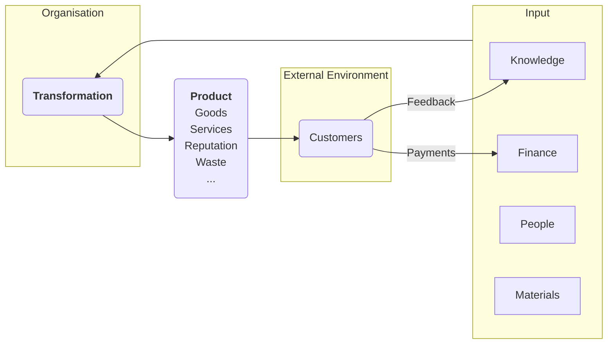

---
tags:
  - Management
aliases:
  - Managers
---
## What is management?

The process of getting things done **effectively** and **efficiently**, through and with other people.
- **Effectiveness**: bring the right results
- **Efficiency**: use the right resources
Therefore, management is about using resources in the most effective and efficient way to achieve a product worth more than the sum of its parts. 

### Management as a Transformation Process

## What do managers do?

- Managers *plan*, *organize*, *lead* and *control*
- Managers make *decisions*
Managerial positions:
- Top Managers $\rightarrow$ Senior Managers $\rightarrow$ Middle Managers $\rightarrow$ First-line Managers $\rightarrow$ Operatives

e.g:
- **Top Managers**: CEO, President, Vice President
- **Senior Managers**: Regional Managers, Division Managers
- **Middle Managers**: Department Managers, Branch Managers
- **First-line Managers**: Supervisors, Team Leaders
- **Operatives**: Employees

#### Management as a human activity
Management is both a **job** and a universal human **activity**.
As a universal human activity, management occurs when we take responsibility for actions, and consciously try to shape **progress** and **outcome**.