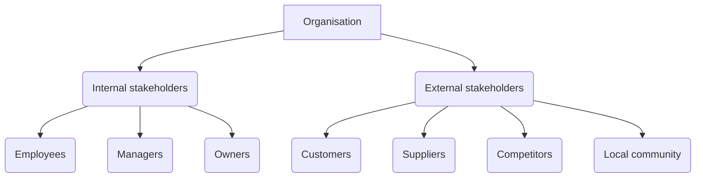

---
tags:
  - Organisation
aliases:
  - Stakeholders
---

## What is an organisation?

An organisation is a **systematic arrangement** of **people** brought together to accomplish some specific **purpose**. It is a social entity that is goal-directed, designed as deliberately structured and coordinated activity systems, and linked to the external environment. 

- **people**: The human factor
- **purpose**: The mission and goals
- **systematic arrangement**: The structure and coordination (see [[Structure]])

> Next time you visit a website, take a look at the "About Us" page. You will see a description of the organisation, its mission, and its goals. 

If you take people, and give them a purpose, you don't necessarily have an organisation. You are still missing the structure and coordination. 

### Organisation types
- **Commercial organisations**: These are organisations that are set up to make a profit. They can be small or large, and can be privately or publicly owned. 
- **Voluntary organisations**: These are organisations that are set up to provide a service or benefit to others. They are often called **non-profit** organisations. 
- **Government organisations**: These are organisations that are set up by the government to provide services to the public. They are often called **public sector** organisations. 

#### Commercial organisations
- **Sole traders**: These are businesses that are owned and run by one person. They are often small businesses, such as shops or restaurants. 
- **Partnerships**: These are businesses that are owned and run by two or more people. They are often small businesses, such as law firms or accountants. 
- **Limited companies**: These are businesses that are owned by shareholders. They can be small or large, and can be publicly or privately owned. 
- **Franchises**: These are businesses that are owned by one person but operated under a licence from a larger company. They are often fast-food restaurants or car dealerships. 
- **Co-operatives**: These are businesses that are owned and run by their members. They are often set up to provide a service or benefit to the community. 

#### Voluntary organisations
- **Charities**: These are organisations that are set up to help people in need. They are often funded by donations from the public. 
- **Professional bodies**: These are organisations that are set up to represent people working in a particular profession. They often set standards for the profession and provide training and support to members. 
- **Trade unions**: These are organisations that are set up to represent workers in a particular industry. They negotiate with employers on behalf of their members to improve pay and working conditions. 
- **Clubs**: These are organisations that are set up to provide social or recreational activities for members. They are often run by volunteers. 

#### Government organisations
- **Central government**: These are organisations that are set up by the government to provide services to the public at a national level. They are often called **government departments**. 
- **Local government**: These are organisations that are set up by the government to provide services to the public at a local level. They are often called **local authorities**. 
- **Public corporations**: These are organisations that are set up by the government to provide services to the public that are not provided by the private sector. They are often called **quangos**. 

## Stakeholders
**Stakeholders** are individuals or groups who have an interest or are affected by what an organisation does. They can be **internal** or **external** to the organisation. 
> Not to be confused with **shareholders**!
> Shareholders are also stakeholders, but not all stakeholders are shareholders. 
- **Internal stakeholders**: These are individuals or groups who are directly involved in the activities of the organisation. They can include employees, managers, and owners. 
	 *Human resources*:
		- **Employees**: These are individuals who work for the organisation. They can include full-time, part-time, and temporary staff. 
		- **Managers**: These are individuals who are responsible for running the organisation. They can include senior managers, middle managers, and team leaders. 
		- **Owners**: These are individuals who own the organisation. They can include shareholders, partners, and sole traders. 

- **External stakeholders**: These are individuals or groups who are indirectly affected by the activities of the organisation. They can include customers, suppliers, competitors, and the local community. 
	- **Customers**: These are individuals who buy goods or services from the organisation. They can include individual consumers, businesses, and other organisations. 
	- **Suppliers**: These are individuals or groups who provide goods or services to the organisation. They can include manufacturers, wholesalers, and distributors. 
	- **Competitors**: These are individuals or groups who provide similar goods or services to the organisation. They can include other businesses in the same industry. 
	- **Local community**: These are individuals or groups who live or work near the organisation. They can include residents, local businesses, and community groups. 
	- **[[Shareholders]]**: These are individuals or groups who own shares in the organisation. They can include individual investors, institutional investors, and pension funds.

