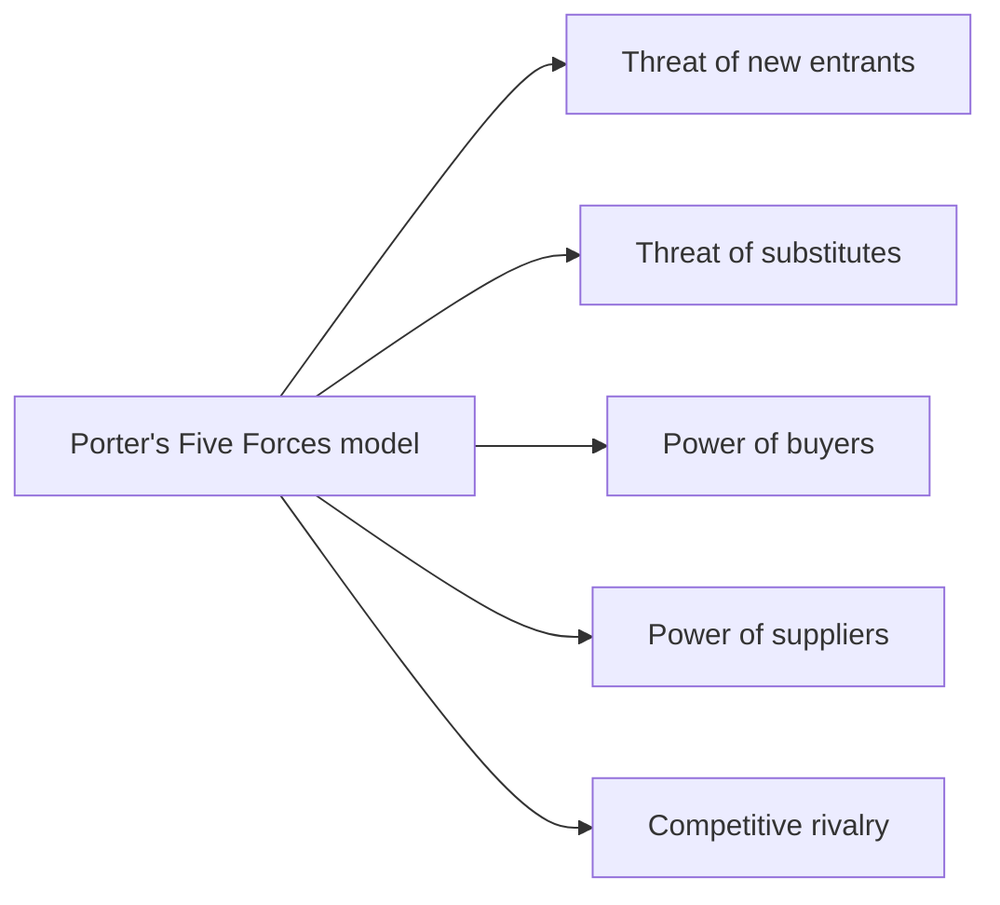
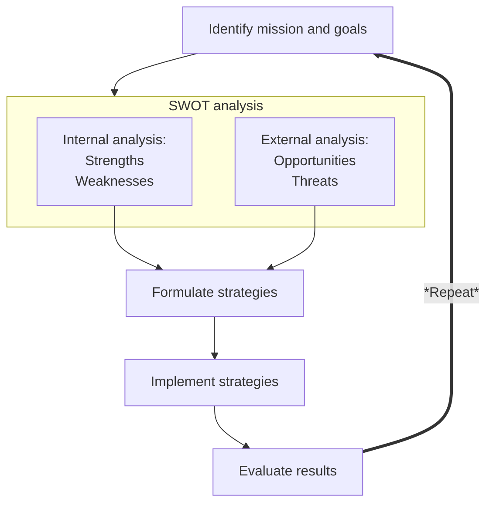

# Strategic Planning

## Advantages of Planning

- Provides **direction**
- Reduces uncertainty
- Reduces wasteful / overlapping activities
- Helps use resources efficiently

## The External Environment / Macro-Environment

*Planning* is also very important because the external environment of an organisation is **changing** all the time.

The organisation's external environment includes the following factors:

### PESTLE Analysis

- Political
	- Government policies, legislation, political stability
- Economic
	- Inflation, interest rates, exchange rates
- Socio-cultural
	- Demographics, consumer trends, lifestyle changes
- Technological
	- New technologies, automation, research and development
- Legal
	- Health and safety, employment, consumer protection
- Environmental
	- Climate change, pollution, waste management

## Tools to Manage the External Environment

### Porter's Five Forces Model

- Developed by Michael Porter
- Helps businesses to understand the competitive environment
- Identifies five key factors that affect the level of competition in an industry
- Helps businesses to develop strategies to improve their competitive position
---

## The Strategic Management Process

### SWOT Analysis

