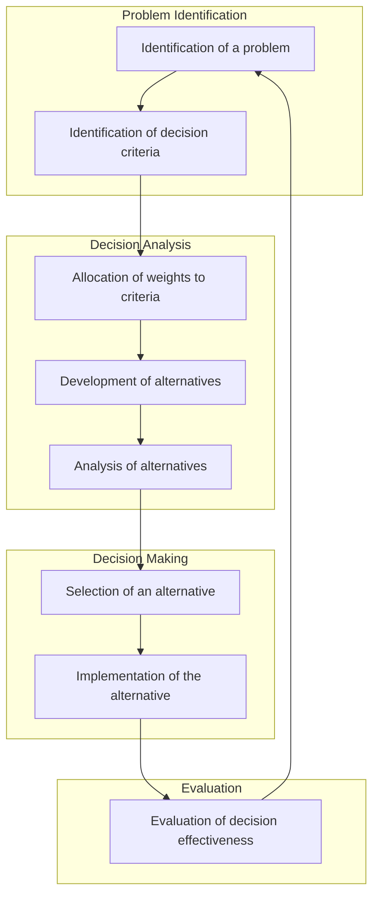

## Decision making conditions
- **Certainty**: The decision maker **knows** exactly what will happen in the future.
- **Uncertainty**: The decision maker **does not know** what will happen in the future.
- **Risk**: The decision maker doesn't know what will happen in the future, but can **estimate** the probabilities of various outcomes. 
	- Basically measurable uncertainty.
- **Ambiguity**: The decision maker doesn't know what will happen in the future, and cannot even make a reasonable estimate of the probabilities of various outcomes.

### An Example 
| Type of investment | Condition of market | Good | Moderate | Poor |
| ------------------ | ------------------- | ---- | -------- | ---- |
| A                  |                     | 200  | 100      | 50   |
| B                  |                     | 400  | -40      | -90  |
| C                  |                     | 550  | -80      | -120 |

#### A
- No matter what the condition of the market, A will always give a positive return,
- Therefore, A is the best choice under certainty. (200, 100, 50)/3 = 116.67
#### B
- B will give a positive return in a good market, but will give a negative return in a moderate or poor market. (400, -40, -90)/3 = 90

#### C
- C will give a great return in a good market, but will give a massive loss in a moderate or poor market. (550, -80, -120)/3 = 116.67

#### Maximax method
- Choose the alternative with the maximum possible payoff.
- In this case, an optimistic decision maker will choose C.
	This is the method  that gambling addicts commonly use.
- The problem with this method is that it does not account for risk.

#### Maximin method
- Choose the alternative with the maximum possible minimum payoff.
- In this case, a pessimistic decision maker will choose A.
- Such a decision maker is called **risk-averse** or **conservative**.
#### Laplace / Expected value method
- Choose the alternative with the maximum average payoff.
- In this case, the decision maker will choose C.
- This method is used by decision makers who are indifferent to risk or uncertainty.
- This method requires the decision maker to assign specific coefficients to each possible outcome. Then, the decision maker multiplies each outcome by the probability of that outcome, and adds them up.

Case A as an example:

|        | Good   | Moderate | Poor   |
| ------ | ------ | -------- | ------ |
| prob.  | 0.4    | 0.3      | 0.3    |
| return | 200    | 100      | 50     |
|        | p1\*r1 | p2\*r2   | p3\*r3 |

